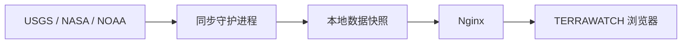

# TERRAWATCH 自托管数据同步

这套组件把访问者浏览器对第三方服务的直接请求，改成由你的服务器统一采集、缓存和发布。它不是每个用户访问时都去请求 USGS 或 NASA：同步进程只按各数据源的更新节奏运行，Nginx 直接提供最后一次成功生成的文件。



## 默认计划

| 数据 | 本地发布文件 | 默认间隔 | 说明 |
|---|---|---:|---|
| 地震 + 自然事件 | `events-latest.geojson` | 4 小时 | 条件请求；USGS/EONET 未改变时不会重复下载。 |
| 全球风场 | `wind-latest.json` | 6 小时 | 对齐 GFS 分析周期。 |
| 表层洋流 | `currents-latest.json` | 每日 | 对齐 OSCAR NRT 的较慢生产节奏。 |

计划在 [`sources.json`](sources.json) 中；`interval_seconds` 可按你的偏好修改。失败后不会清空网站现有数据，而是在 15–60 分钟后重试，并把错误写到 `status.json`。

## 在家用服务器首次安装

以下示例假设代码位于 `/opt/terrawatch`、公开站点位于 `/var/www/terrawatch`、系统为使用 systemd 和 Nginx 的 Linux。你的家用 agent 之后只需要更新仓库、重建站点并重启服务。

```bash
sudo useradd --system --home /var/lib/terrawatch --shell /usr/sbin/nologin terrawatch
sudo install -d -o terrawatch -g terrawatch /var/lib/terrawatch/data /var/lib/terrawatch/state /var/lib/terrawatch/work
cd /opt/terrawatch
python3 -m venv .venv
.venv/bin/pip install -r source/sync/requirements-vector.txt
```

若启用洋流，请复制 `source/deploy/terrawatch.env.example` 到 `/etc/terrawatch/environment`，填入 NASA Earthdata token，并限制权限：

```bash
sudo install -d -m 0750 /etc/terrawatch
sudo install -m 0640 -o root -g terrawatch source/deploy/terrawatch.env.example /etc/terrawatch/environment
```

第一次拉取可以手动执行；它会建立 `events-latest.geojson` 与 `status.json`。没有 Earthdata token 时仅洋流任务会失败，事件和风场仍会继续运行。

```bash
cd /opt/terrawatch/source
sudo -u terrawatch /opt/terrawatch/.venv/bin/python sync/terrawatch_sync.py \
  --once --force \
  --output-dir /var/lib/terrawatch/data \
  --state-dir /var/lib/terrawatch/state
```

安装并启动常驻同步服务：

```bash
sudo install -m 0644 deploy/terrawatch-sync.service /etc/systemd/system/terrawatch-sync.service
sudo systemctl daemon-reload
sudo systemctl enable --now terrawatch-sync
sudo systemctl status terrawatch-sync
```

## 发布站点与缓存代理

构建静态站点后，把 `source/out/` 的内容部署到 `/var/www/terrawatch/`；然后用自托管的运行时配置替换默认配置，使前端改读本机 `/data/` 与 `/tiles/`：

```bash
cd /opt/terrawatch/source
npm ci
npm run build:static
sudo rsync -a --delete out/ /var/www/terrawatch/
sudo install -m 0644 deploy/terrawatch-config.self-hosted.js /var/www/terrawatch/terrawatch-config.js
```

将 [`../deploy/nginx-self-hosted.conf`](../deploy/nginx-self-hosted.conf) 安装到 Nginx 的 `conf.d`，把 `server_name` 改成自己的域名，并配置 HTTPS。该配置做两件事：

- `/data/` 读取同步守护进程的原子快照；
- `/tiles/gibs/` 与 `/tiles/carto/` 由你的服务器代理并磁盘缓存。第一次看到某个缩放级别时服务器会拉取它，之后各地用户都命中你的缓存。它不会盲目预下载全球每一级瓦片。

检查配置并重载：

```bash
sudo nginx -t
sudo systemctl reload nginx
```

浏览器可检查 `https://你的域名/data/status.json`。它显示最后尝试、最后成功、上游缓存验证信息和是否存在回退到旧快照的情况；它不包含 Earthdata token。

## 日常更新

```bash
cd /opt/terrawatch
git pull --ff-only
cd source
npm ci
npm run build:static
sudo rsync -a --delete out/ /var/www/terrawatch/
sudo install -m 0644 deploy/terrawatch-config.self-hosted.js /var/www/terrawatch/terrawatch-config.js
sudo systemctl restart terrawatch-sync
sudo systemctl reload nginx
```

如果你只改了同步代码或 `sources.json`，无需重新构建前端，只需 `git pull --ff-only` 后重启 `terrawatch-sync`。同步进程有单实例锁，所以手动运行 `--once` 时不会和守护进程同时写入数据。
